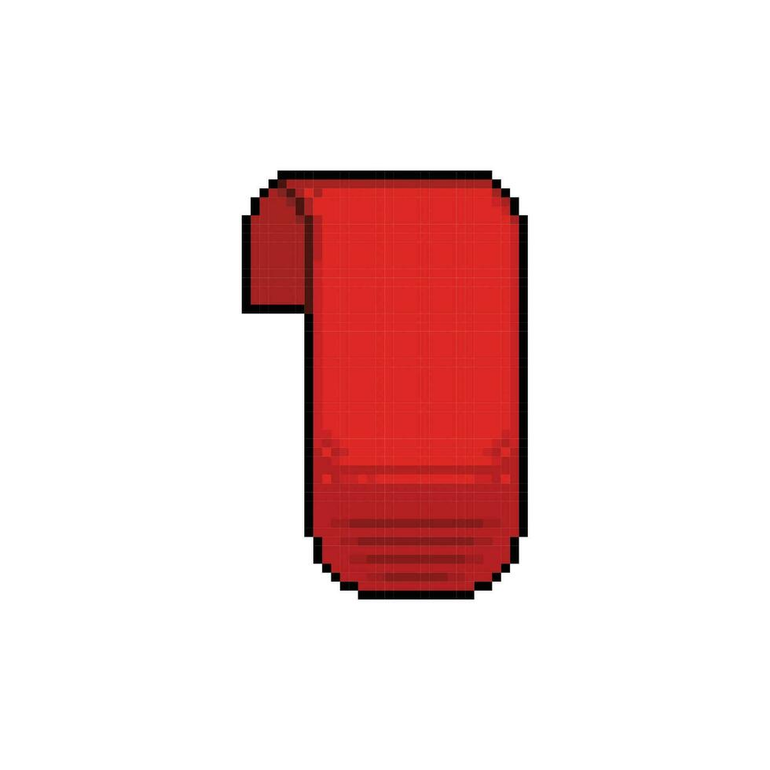

# Website-Project
mddn242 project 1 - website

# design plan/ideas:
all pages - pixelated art style
    - red carpet with gold trim, (overgrown) stone brick walls, old style chandeliers and lanterns, stained glass windows
    - menu in top left allowing users to navigate easily between pages (instead of navigating on the page e.g. clicking on doors/ hallways etc.)
    ⤷ looks like paper scrolls or banners (one for each page) hanging down
    ⤷ current page hangs down further than others
    ⤷ when hovering over non-current page, banner 'slides' down a bit (hanging height between non-selected and current page)
    ⤷ when hovering over 'works/ gallery' page, more banners fall down for individual sections/ rooms
------------insert image here-----------------
    - compass in bottom right which shows small version off map page ----------?
    - custom cursor (sceptre, sword, knights hand) 
------------insert image here-----------------
    - music controls in top right corner 
    ⤷ same design as menu (scrolls/ banners) but roles from side outwards when clicked on to reveal all options
    ⤷ controls: pause, play, volume, song name, artist, link to credit, (skip song if applicable)
    ⤷ soft lo-fi music plays, specific to each page?
    - press on floor near bottom of page to go back to previous page? or have small scroll on left side of page with back button?

🏰landing page - view of castle door with 'welcome in' sign
    - press on door or 'welcome' sign to enter into home page (or click pages in 'banner menu')
    ⤷ door opens and 'camera' zooms in to view home page aka castle atrium
    ⤷ creaking sound when door opens?
    - little critters running around lawn, flying in sky (if visible)
    - moss/ vines flowing / moving in the wind
    - weather changes depending on users locational weather? or on random cycle?
    - lighting changes depending on users current time? or on time cycle (every hour?)

🏰home page - castle forum/ atrium
    - hallways/ doors to different website pages, when clicking on where user wants to go, door opens/ camera zooms into hall way
    ⤷ hallway straight ahead for works page aka gallery
    ⤷ door to left for about page aka throne room
    ⤷ door to right for settings and information

👑about page - throne or study room
    - date when last updated (shown as calendar)
    - info about me (scroll hanging on wall)
    - picture of me? or drawing of avatar (picture frame)
    - my goals as a designer 
    - current passions/ interest (as a book shelf? when book is pressed on shows more info and links to page about interest?)
    - my background/ story
    - letter to future self?
    - link contact information in info page

📜works page - gallery made up of hallways and rooms
    - walk around like '3d map'? use scroll wheel, mouse to click forward (like google street view), WASD keys?
    - start in hallway
    - works are displayed in picture frames on walls
    ⤷ click on picture to get close up and more information
    - as I do more work, more rooms/ hallways get added, each with a different focus on different areas (each being their own page with own favicons)

⭐info page - room which contains miscellaneous information 
    🧭map case in centre of room - shows map of castle with clickable rooms that bring user to desired section for easy navigation (also accessible via compass)
    -------------- insert image here -----------------------
    🛠️settings wall - allow users to customize their experience for accessibility
        - stop custom curser change
        - music settings again
        - stop movement?
        - even easier navigation for accessibility?
    💡info wall 
        - details to how website was created? website metrics? how often page was visited, carbon
        - contact information
        - where else to find me? social media may haps?
        - questions box?
        - sign up for news letter when new works are uploaded/ website is updated?

other stuff:
    - include some hidden rooms with fun secrets? random facts? mini games? puzzles?
    - mirror where user can make their avatar? (probably too ambitious as it will need to store user information somewhere...)

# working with AI
I use the Claude ai bot (sonnet 4.6)

💡asking it to make the navigation menu
I showed it all my HTML files, my styles.css and script.js file, and an image of an example banner  with the following prompt:
    please create a menu in the top left corner of the page which allows the user to navigate between all html pages. please use the image 'blank-red-banner-in-pixel-art-style-vector.jpg' as a style reference and keep it in a pixel art style. I want each html to have its own 'banner' (shown in image). when a user is on an html and want its banner hanging lower than the others.
-I used the built in side panel to display the website with the AI's changes so that I didn't need to copy everything over immediately. this was useful at first but turns out that the 'sidebar' cant pull external sources and therefore wasn't displaying the banners. 
i found this out by telling Claude: 
    when viewing it in the Claude's preview side bar it still doesnt show.
    the console is giving the follow errors:
    Failed to load resource: net::ERR_BLOCKED_BY_CLIENT
claude answered: 
    The preview sidebar itself is blocking external resources. Let me rebuild the nav as a fully self-contained single HTML artifact with zero external dependencies — everything inline.
after a bit more conversing it showed me this:

-the downside is that everything is internal now so that it could show in the sidebar and not run via images. this makes it hard to edit and understand so i will re-run my initial request but then paste things into here aka vstudio. 
-i also dont like the look of the banners so i have drawn my own using pixel art which i can then show it and hopefully get a better result.

prompt #2
    please create a menu in the top left corner of the page which allows the user to navigate between all html pages. please use the image 'row of red banners' as a direct reference and keep it in a pixel art style. I want each html to have its own 'banner' (shown in image) hanging down from the top of the page. when a user is on an html I want its banner hanging lower than the others. please make this easily editable and preferably keep it all in the script.js and styles file without adding every individual element to each html file
    
response:
    Here's what was built and how it works:
    script.js — The single source of truth. At the top is a CASTLE_PAGES array — just edit that array to add, remove, or rename pages and their emojis. The script auto-detects which page is currently open (by filename), builds the banner HTML, and injects it as the very first element in <body> on every page automatically.
    styles.css — All the pixel art styling lives here. At the top is a :root block with CSS variables you can tweak:
    --px — scales the entire nav up or down (currently 4px = 1 pixel unit)
    --banner-h / --banner-h-active — controls how tall inactive vs active banners are (active hangs lower)
    Colour variables for the rod, rings, cloth, and text
    
    All HTML files — The old static <nav> was removed. No changes needed per-page; the nav appears everywhere as long as <script src="script.js"> is present (which all your files already had).
    The active page's banner hangs noticeably lower than the others, with a gold dot on the rod above it. Hovering inactive banners triggers a pixel-step sway animation.
output:

opinion:
    -im very happy with how it explained everything to me and it made the banners very easily editable
    -it lost the pixelated style and each banner 'wobbles' when hovering over it. the last prompt was a lot closer to what i wanted so i will try to refine the current prompt
prompt #2.3 for further refining:
    please make the banners an exact version of the image attached here called 'row of red banners'. i would like it so that when the user hovers over one of the banners, that it slides down a little to be a length between the non-selected and selected page banners. please make this easily editable and preferably keep it all in the script.js and styles file without adding every individual element to each html file
response:
    The banners have been rebuilt from scratch using pixel-by-pixel measurements taken from your reference image. Here's what was done:
    How the shape was made: I ran a Python script that scanned every pixel of the reference image to extract exact measurements — the rod is 10px tall, each banner is 88px wide, and the bottom taper was traced point-by-point (e.g. "at 84% height, indent 0px; at 89%, indent 8px; at 94%, indent 22px; at 100%, tip is 18px wide"). These exact coordinates were baked into an SVG polygon inside each banner, so the bottom shape is identical to the reference.
    The three states:
    Inactive — shorter hang (--cb-h: 118px)
    Hover — slides down smoothly to halfway (--cb-h-hover: 138px)
    Active/current page — hangs at full length (--cb-h-active: 157px)
    Easy edits are all in styles.css at the top :root block — adjust --cb-scale to resize everything, or tweak the three height variables to change how far banners hang. Pages are still just the CASTLE_PAGES array in script.js.
output:

opinion:
    -moves down now when hovering over un-selected banner but doesnt look like the given picture. I will try to reword the prompt to use specific pictures rather than 
prompt #2.3:
    please retry and use the exact images given. it needs to keep the pixel art style. please make this easily editable and preferably keep it all in the script.js and styles file. don't touch the html files
response:
    This time the actual red_banner.png image is used directly. Here's exactly what was done:
    How it works: I ran a Python flood-fill algorithm starting from the image corners to identify background black pixels vs. outline/content black pixels, then created a transparent PNG version of the banner. That transparent PNG (53×59px) is base64-encoded and embedded directly inside script.js — no external image files needed.
    The nav structure:
    The rod is drawn with CSS (matching the wood brown colors from the row image)
    Each banner is an  tag pointing to the embedded base64 PNG, displayed at 2× native size (106×118px) using image-rendering: pixelated to keep crisp pixel art edges
    The banner's parent <a> has overflow: hidden, so changing its height clips the image from the bottom — shorter = less of the taper shows
    The three height states (all easily editable in styles.css :root):
    --cb-h-inactive: 76px — banner body visible, taper mostly hidden
    --cb-h-hover: 96px — slides smoothly to mid-length on hover
    --cb-h-active: 118px — full banner visible for the current page
    No HTML files were modified — the script injects everything on page load.
output:

opinion:
    better but not perfect. i will need to draw each individual banner length and insert them as seperate images. i also need to make them at a higher resolution.