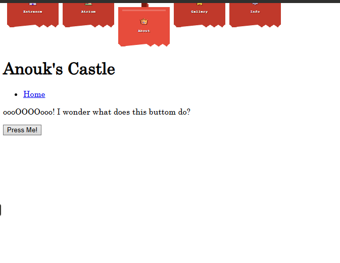
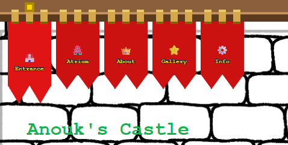
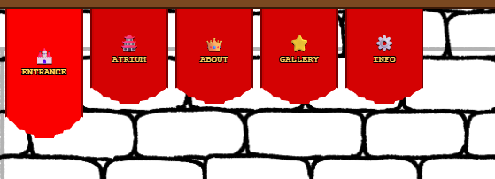
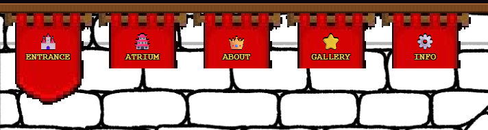
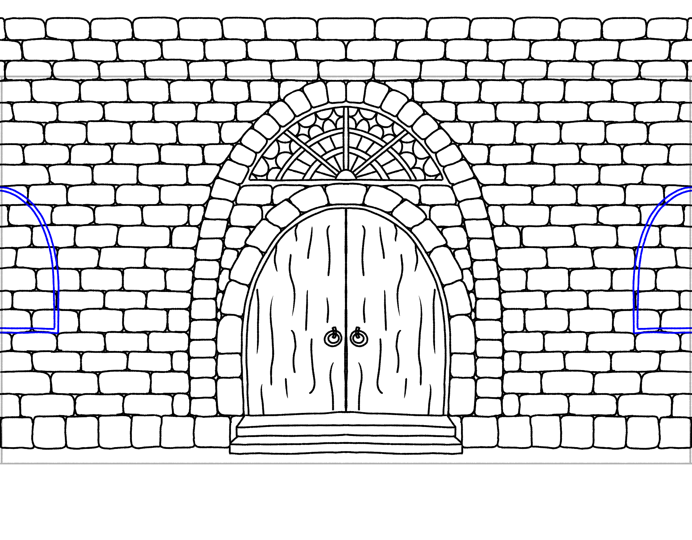
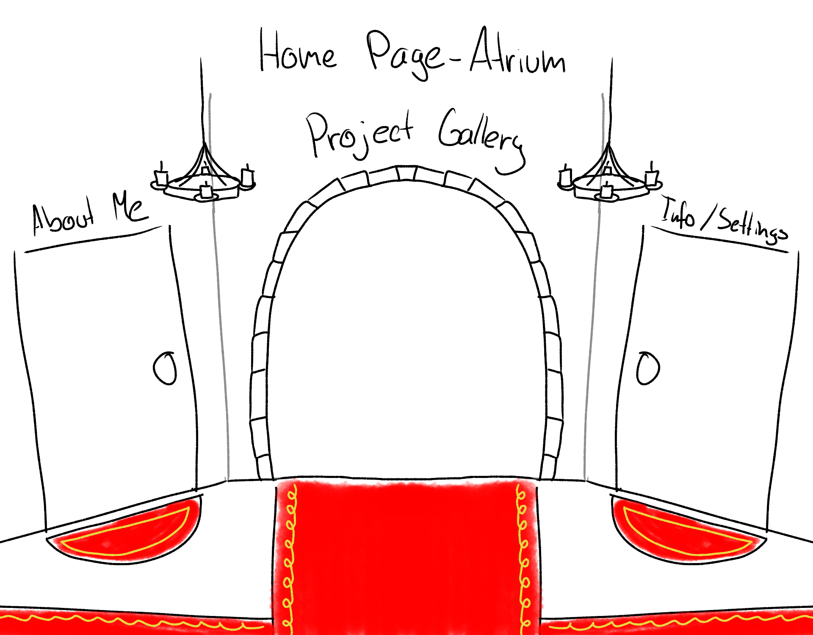

# Website-Project
mddn242 project 1 - website

goals:
    my main goal through this project is to get comfortable using AI. so far i have had a very opposed mindset towards AI so i want to use this course/ project to interact with it more and hopefully build a more open response to it and learn how it can help us grow as designers or even humans. 

# design plan/ideas:
all pages - pixelated art style
    - red carpet with gold trim, (overgrown) stone brick walls, old style chandeliers and lanterns, stained glass windows
    - menu in top left allowing users to navigate easily between pages (instead of navigating on the page e.g. clicking on doors/ hallways etc.)
    ⤷ looks like paper scrolls or banners (one for each page) hanging down
    ⤷ current page hangs down further than others
    ⤷ when hovering over non-current page, banner 'slides' down a bit (hanging height between non-selected and current page)
    ⤷ when hovering over 'works/ gallery' page, more banners fall down for individual sections/ rooms
------------insert image here-----------------
    - compass in bottom right which shows small version off map page ----------?
    - custom cursor (sceptre, sword, knights hand) 
------------insert image here-----------------
    - music controls in top right corner 
    ⤷ same design as menu (scrolls/ banners) but roles from side outwards when clicked on to reveal all options
    ⤷ controls: pause, play, volume, song name, artist, link to credit, (skip song if applicable)
    ⤷ soft lo-fi music plays, specific to each page?
    - press on floor near bottom of page to go back to previous page? or have small scroll on left side of page with back button?

🏰landing page - view of castle door with 'welcome in' sign
    - press on door or 'welcome' sign to enter into home page (or click pages in 'banner menu')
    ⤷ door opens and 'camera' zooms in to view home page aka castle atrium
    ⤷ creaking sound when door opens?
    - little critters running around lawn, flying in sky (if visible)
    - moss/ vines flowing / moving in the wind
    - weather changes depending on users locational weather? or on random cycle?
    - lighting changes depending on users current time? or on time cycle (every hour?)

🏰home page - castle forum/ atrium
    - hallways/ doors to different website pages, when clicking on where user wants to go, door opens/ camera zooms into hall way
    ⤷ hallway straight ahead for works page aka gallery
    ⤷ door to left for about page aka throne room
    ⤷ door to right for settings and information

👑about page - throne or study room
    - date when last updated (shown as calendar)
    - info about me (scroll hanging on wall)
    - picture of me? or drawing of avatar (picture frame)
    - my goals as a designer 
    - current passions/ interest (as a book shelf? when book is pressed on shows more info and links to page about interest?)
    - my background/ story
    - letter to future self?
    - link contact information in info page

📜works page - gallery made up of hallways and rooms
    - walk around like '3d map'? use scroll wheel, mouse to click forward (like google street view), WASD keys?
    - start in hallway
    - works are displayed in picture frames on walls
    ⤷ click on picture to get close up and more information
    - as I do more work, more rooms/ hallways get added, each with a different focus on different areas (each being their own page with own favicons)

⭐info page - room which contains miscellaneous information 
    🧭map case in centre of room - shows map of castle with clickable rooms that bring user to desired section for easy navigation (also accessible via compass)
    -------------- insert image here -----------------------
    🛠️settings wall - allow users to customize their experience for accessibility
        - stop custom curser change
        - music settings again
        - stop movement?
        - even easier navigation for accessibility?
    💡info wall 
        - details to how website was created? website metrics? how often page was visited, carbon
        - contact information
        - where else to find me? social media may haps?
        - questions box?
        - sign up for news letter when new works are uploaded/ website is updated?

⚠️404 error page -death screen?

other stuff:
    - include some hidden rooms with fun secrets? random facts? mini games? puzzles?
    - mirror where user can make their avatar? (probably too ambitious as it will need to store user information somewhere...)

# coding with AI
I use the Claude ai bot (sonnet 4.6)

notes:
    12/03/2026
    really happy with how working with AI is going. I keep getting pleasantly surprised by how well it carries out certain tasks. I also really like how it explains everything and does the coding in a way that i can edit it (most likely due to me adding 'please make this easily editable') which helps me accomplish my goal of learning and understanding how the code works. I do notice that often it does/changes things i didnt ask it too which is kind of frustrating because you have to specify all the things that are supposed to stay the exact same.
    19/03/26
    im starting to get more and more frustrated with not being able to have full control over the entire design/ code as it is really difficult to change/ edit certain things without using the AI. (e.g. the 'button' that overlays the entrance door of the castle is not how i want it to be but I cant edit it to perfectly fit the door due to how its coded and my limited knowledge to how it works). This basically means thats if I use AI once, i have to use it for everything but it can never perfectly make what I want it to (this may be caused by me not communicating my wishes/ thoughts properly but it still sometimes doesnt seem to do what I ask it to or changes things without getting instruction to do so) The only solution I can think of is that I would need to learn how the code works (aka learn CSS, JS, HTML etc) so that I can make changes myself. If i would have to use AI, i would get it to code the base idea and then I go in with my coding skills and make everything perfect to how I want it. In a way this is a good but also bad thing as this means that the skill of coding is still very necessary and cant be replaced by AI (at least not soon?) but also means that I cant make this project exactly what I want it to be with my current skills set as I dont know how to code the things I need to.
    Overall i find this frustrating and really limiting and wish we would be taught how to do these things rather than relying to AI. MNy solution is to find (free) online courses/websites that teach me the different languages and hopefully I wont be so limited in the future. Sadly that isnt possible for this project so I will need to do my best with what I can and just accept that I cant make it truly what I want it to be. 

**asking it to make the navigation menu**
I showed it all my HTML files, my styles.css and script.js file, and an image of an example banner  with the following prompt:
    please create a menu in the top left corner of the page which allows the user to navigate between all html pages. please use the image 'blank-red-banner-in-pixel-art-style-vector.jpg' as a style reference and keep it in a pixel art style. I want each html to have its own 'banner' (shown in image). when a user is on an html and want its banner hanging lower than the others.
-I used the built in side panel to display the website with the AI's changes so that I didn't need to copy everything over immediately. this was useful at first but turns out that the 'sidebar' cant pull external sources and therefore wasn't displaying the banners. 
i found this out by telling Claude: 
    when viewing it in the Claude's preview side bar it still doesnt show.
    the console is giving the follow errors:
    Failed to load resource: net::ERR_BLOCKED_BY_CLIENT
claude answered: 
    The preview sidebar itself is blocking external resources. Let me rebuild the nav as a fully self-contained single HTML artifact with zero external dependencies — everything inline.
after a bit more conversing it showed me this:

-the downside is that everything is internal now so that it could show in the sidebar and not run via images. this makes it hard to edit and understand so i will re-run my initial request but then paste things into here aka vstudio. 
-i also dont like the look of the banners so i have drawn my own using pixel art which i can then show it and hopefully get a better result.

prompt #2
    please create a menu in the top left corner of the page which allows the user to navigate between all html pages. please use the image 'row of red banners' as a direct reference and keep it in a pixel art style. I want each html to have its own 'banner' (shown in image) hanging down from the top of the page. when a user is on an html I want its banner hanging lower than the others. please make this easily editable and preferably keep it all in the script.js and styles file without adding every individual element to each html file
    
response:
    Here's what was built and how it works:
    script.js — The single source of truth. At the top is a CASTLE_PAGES array — just edit that array to add, remove, or rename pages and their emojis. The script auto-detects which page is currently open (by filename), builds the banner HTML, and injects it as the very first element in <body> on every page automatically.
    styles.css — All the pixel art styling lives here. At the top is a :root block with CSS variables you can tweak:
    --px — scales the entire nav up or down (currently 4px = 1 pixel unit)
    --banner-h / --banner-h-active — controls how tall inactive vs active banners are (active hangs lower)
    Colour variables for the rod, rings, cloth, and text
    
    All HTML files — The old static <nav> was removed. No changes needed per-page; the nav appears everywhere as long as <script src="script.js"> is present (which all your files already had).
    The active page's banner hangs noticeably lower than the others, with a gold dot on the rod above it. Hovering inactive banners triggers a pixel-step sway animation.
output:

opinion:
    -im very happy with how it explained everything to me and it made the banners very easily editable
    -it lost the pixelated style and each banner 'wobbles' when hovering over it. the last prompt was a lot closer to what i wanted so i will try to refine the current prompt
prompt #2.3 for further refining:
    please make the banners an exact version of the image attached here called 'row of red banners'. i would like it so that when the user hovers over one of the banners, that it slides down a little to be a length between the non-selected and selected page banners. please make this easily editable and preferably keep it all in the script.js and styles file without adding every individual element to each html file
response:
    The banners have been rebuilt from scratch using pixel-by-pixel measurements taken from your reference image. Here's what was done:
    How the shape was made: I ran a Python script that scanned every pixel of the reference image to extract exact measurements — the rod is 10px tall, each banner is 88px wide, and the bottom taper was traced point-by-point (e.g. "at 84% height, indent 0px; at 89%, indent 8px; at 94%, indent 22px; at 100%, tip is 18px wide"). These exact coordinates were baked into an SVG polygon inside each banner, so the bottom shape is identical to the reference.
    The three states:
    Inactive — shorter hang (--cb-h: 118px)
    Hover — slides down smoothly to halfway (--cb-h-hover: 138px)
    Active/current page — hangs at full length (--cb-h-active: 157px)
    Easy edits are all in styles.css at the top :root block — adjust --cb-scale to resize everything, or tweak the three height variables to change how far banners hang. Pages are still just the CASTLE_PAGES array in script.js.
output:

opinion:
    -moves down now when hovering over un-selected banner but doesnt look like the given picture. I will try to reword the prompt to use specific pictures rather than 
prompt #2.3:
    please retry and use the exact images given. it needs to keep the pixel art style. please make this easily editable and preferably keep it all in the script.js and styles file. don't touch the html files
response:
    This time the actual red_banner.png image is used directly. Here's exactly what was done:
    How it works: I ran a Python flood-fill algorithm starting from the image corners to identify background black pixels vs. outline/content black pixels, then created a transparent PNG version of the banner. That transparent PNG (53×59px) is base64-encoded and embedded directly inside script.js — no external image files needed.
    The nav structure:
    The rod is drawn with CSS (matching the wood brown colors from the row image)
    Each banner is an  tag pointing to the embedded base64 PNG, displayed at 2× native size (106×118px) using image-rendering: pixelated to keep crisp pixel art edges
    The banner's parent <a> has overflow: hidden, so changing its height clips the image from the bottom — shorter = less of the taper shows
    The three height states (all easily editable in styles.css :root):
    --cb-h-inactive: 76px — banner body visible, taper mostly hidden
    --cb-h-hover: 96px — slides smoothly to mid-length on hover
    --cb-h-active: 118px — full banner visible for the current page
    No HTML files were modified — the script injects everything on page load.
output:

opinion:
    better but not perfect. i will need to draw each individual banner length and insert them as separate images. i also need to make them at a higher resolution.

**making the transition from index to home page**
prompt 1: 
    Can you please take these files and create a 'transition' that takes the user from the index page to the home page. Please use the exact images attached. The 'final landing image 1.png' will be the default background for the 'index' page and the 'home image pt1.png' will be the default for the 'home' page. Please make it so that when the user clicks on the door in the index page, that a short animation of the doors opening plays (using 'final landing image 2.png' and 'final landing image 3.png') and then the user is taken to the 'home' page. please make this easily editable and easy to understand so i can later change things manually.
response:
    Here's what was built! Make sure all the image files (final_landing_image_1/2/3.png and home_image_pt1.png) are in the same folder as your HTML files.
    How the transition works:
    index.html shows the closed-door scene — a transparent button sits invisibly over the door area
    Clicking it swaps to frame 2 (doors cracking open) → then frame 3 (doors wide open) → fades to black → navigates to home.html
    home.html starts black and fades in, revealing the atrium interior
    Easy things to tweak — all labelled with comments:
    Door click zone size/position → in index.html, find #door-hotspot and edit left, top, width, height (in %). Uncomment the red debug box line to see exactly where it sits while adjusting
    Animation speed → edit FRAME_2_DURATION and FRAME_3_DURATION (milliseconds) in the JS block in index.html
    Fade duration → change --fade-duration in the CSS :root of either file
    Destination page → change DESTINATION in index.html's JS
    Home page door links → the three <a> elements in home.html have adjustable href and position percentages
output:

opinion:
    fantastic! super happy with what it made. the transition is very smooth and perfectly does what i asked. The quality of the 'landing page' images isnt the best so I will need to fix that. Claude coded it by creating a button that lays over the door which is quite smart, however it is in a box shape which doesnt really match the background image and it would look better if the button was the exact shape as the door. the button is transparent but has a golden outline when hovering over it which i like because it makes it look like its glowing and magical. Claude also added a text at the bottom of the door saying '✦ Click the door to enter ✦' which i quite like. I also like the font it used but I will need to do research to see if it is 'web-safe' and viewable on all devices/ browsers. It also automatically linked the 'about me', 'project gallery', and 'info/settings' page without me asking it too which is awesome. 
prompt 1.2:
    this is awesome! can you please take the files you made and edit them a little. I would like the button that you created for opening the door, to be the shape of the door (square at bottom and rounded at top) rather than just a rectangle. I have attached the original 'landing image pt3.png' so you can see the shape and size of the door.
response:
    Done! The clickable hotspot is now arch-shaped — flat across the bottom and a proper semicircle across the top, matching the door.
    How it works: A small script runs on load and measures the button's actual pixel dimensions, then mathematically generates a clip-path polygon that traces the arch. It also recalculates on window resize so it always fits perfectly.
    If you need to adjust the fit:
    Move/resize the whole area → edit left, top, width, height on #door-hotspot in the CSS (same as before)
    Change the arch curve → edit --arch-curve: 50 — higher numbers make a taller arch, lower numbers flatten it
    Debug the shape → uncomment the line /* #door-hotspot { background: rgba(255, 0, 0, 0.3) !important; } */ to see the arch as a red overlay while you tune it
output:
    
opinion:
    the shape isnt perfect but i will try to tweak it with the editable variables it gave me. I think its very cool that id added a 'debug shape' so that i can see what it looks like while i edit it, its very handy and shows that it takes consideration for my original request of making it easily editable. It also changed the button from only having a yellow outline to being a solid, slightly transparent yellow shape which i dont like as i prefer the outline and the 'glow effect' it would give when aligned with the door.

**making the gallery corridor and side rooms**
prompt 1:
    please take these files and help me make the following:
    i want the gallery to be a corridor that the user can walk down (using the scroll wheel to move back and forth). I want the walls to have picture frames on them that i can add images to. I want to be able to add the images on my own and I also want to be able to rearrange the picture frames using the code you make. I also want the corridor to have some doors here and there that the user can click on to enter into other rooms that also have picture frames on the walls. When the user clicks on a picture frame it will show the image across the entire screen including a small description and name of the picture (that i can add and edit using the code)
    This is all supposed to work together so i can show off the art/ projects I have done. 
    Please explain everything you do to me and make the code easy to understand and so that i can easily edit everything to make the layout of the picture frames and doors however i like. 
    let me know if anything is unclear and you need more information.
response:
    This is a really fun project! Before I dive in, let me ask a couple of quick questions to make sure I build exactly what you need.Go ahead and answer those and I'll get building! Here's a quick overview of what I'm planning to make for you so you know what to expect:
    The Gallery System will have:
    gallery.html — the main corridor page with scroll-to-walk movement
    gallery-room.html — a template for side rooms (you'll duplicate it for each room)
    gallery-data.js — ⭐ the one file you edit to add images, change descriptions, rearrange frames, and configure doors. No touching the main code needed!
    The corridor will use a CSS perspective/3D trick to give the feeling of walking down a hallway, with picture frames on the left and right walls. Scrolling moves you forward and backward. Doors will be clickable portals to your side rooms. Clicking a frame opens a fullscreen lightbox with the image name and description.
questions it asked and my answers:
    Q: What visual style should the gallery corridor have?
    A: Stone dungeon / medieval castle (matches your castle theme)
    Q: What kind of art/projects will you be displaying? (Select all that apply)
    A: Mixed / all of the above
    Q: How many rooms are you thinking to start with?
    A: 2–3 side room
response: 
    Here's everything you need! Here's a full breakdown of what was built and how to use it:
    📁 Your 7 Files
    Put all of these in the same folder as your existing styles.css and script.js.
    gallery.html = The main corridor page — link to this from your castle
    gallery-styles.css = All the visual styling (stone walls, gold frames, torches)
    gallery-engine.js = The engine that reads your data and builds everything — don't touch
    gallery-data.js = ⭐ The only file you edit
    gallery-room-studio.html = Room 1
    gallery-room-archive.html = Room 2
    gallery-room-workshop.html = Room 3
    ✏️ How to add images
    Open gallery-data.js and find the frames array. Each frame looks like this:
        js{
        src: "images/my-painting.png",  // ← path to your image file
        name: "My Painting",
        description: "Made this in 2024 using Procreate.",
        position: "left",   // "left" or "right" wall
        size: "large",      // "small", "medium", or "large"
        },
    Just fill in the src and you're done. Leave src: "" to show a placeholder.
    🔀 How to rearrange frames
    Just cut and paste entries in the array — the order in the list is the order down the corridor. Change position between "left" and "right" to move a frame to the other wall.
    🚪 How to move doors
    Each door has an afterFrame number — that's the index (starting at 0) of which frame it appears after:
        js{ afterFrame: 1, side: "right", label: "The Studio", href: "gallery-room-studio.html" }
    This door appears after the 2nd frame (index 1), on the right wall.
    🏠 How to add more rooms
    Duplicate any gallery-room-*.html file and rename it
    Change the one line at the top: const ROOM_ID = "yourNewName";
    Add a matching entry under ROOMS in gallery-data.js
    Add a door in the corridor or another room pointing to it
    🎮 Controls
    Scroll wheel → walk forward/backward
    Arrow keys → also works
    Click a frame → fullscreen lightbox with name + description
    Click a door → enter that room
    Escape → close lightbox
output:
     <---- very zoomed out browser window to show the 'whole thing' it created
opinion:
    It appears that i was not at all clear enough on what i wanted it to look like and only focused on the functionality. 
    The writing is barely readable as the contrast is way too small. I wanted it to be a '3D corridor' rather than a 2D top view which is what it has done. Additionally the entire art style is not at all what i wanted it to be. 
    I am very happy with the functionality and mechanics of it and how it explained it all to me. The 'issues' that i have with its output are purely due to me not including it in the prompt so I will draw some inspo pictures for it to reference and see if it does a better job.
prompt 1.2:
    What's new — the perspective walk system
    How the walking feels: The corridor image from your reference stays fixed on screen but scales up from its vanishing point (the dark archway in the centre) as you scroll. This means it genuinely looks like you're walking into the picture — the arches get bigger, the walls spread outward, exactly like real forward motion.
    How frames appear on the walls: Every frame and door has a calculated "depth" in the corridor. The engine uses perspective maths to figure out where on screen each one should sit — close frames are large and near the edges of the screen, far ones are small and close to the centre vanishing point. As you walk forward, frames ahead of you grow and slide outward, ones behind you shrink and fade.
    One important setup step 🖼️
    Make sure gallery_corridor_image_pt1.jpg is in the same folder as all your other files — the CSS references it by name. If you rename the image, open gallery-styles.css and update this line:
        cssbackground-image: url('gallery_corridor_image_pt1.jpg');
    Two settings you can tune in gallery-engine.js
    If the walking feels too fast or slow, find this line near the top and adjust it:
        jsconst WALK_SPEED = 0.0008;  // lower = slower, higher = faster
    If you want the zoom to go deeper or shallower into the image:
        jsconst MAX_ZOOM = 3.2;  // higher number = zooms in further
    Everything else still works exactly as before — gallery-data.js is the only file you need to edit to add images, rearrange frames, and configure doors.
output:
    
opinion:
    just... kind of terrible... 
    i think the issue is that claude cant actually see what the image looks like and doesnt know where to put the picture frames and doors. It also doesnt 'walk' down the corridor how i had wanted it to but instead just zooms into the picture i provided. That is probably once again due to my prompt and that the AI just took the picture I gave it rather than making its own design.
    There is also no way to exit once entering a room/door
    im not sure how to fix this...

---------------------------------------------------------------------------------------
# creating images with AI 
using gemini - nano banana 2 

notes:
    *-*slight 'moral dilemma' about gemini logo. I would like to remove it to make my website looks cleaner but it feels incorrect and almost 'cheaty/ lying' to fully remove it. from the beginning i was planning to add a small text somewhere on my website (in the settings and info page) that most of the code is generated by AI so I will now add a part that mentions that some images that make up the website are created by AI. i would really love to (and prefer to) do all drawing/ make all images myself but due to the scope of my project and the time limit, i wont be able to and will need the help of AI. I will still draw what I can and always make a rough sketch for the AI to follow so that im doing most of the creative stuff and only have the AI do the 'colouring and pixel style'. My current plan is to remove the logo but thoroughly mention what images where AI generated in the 'settings and info' page
    *-* ran into an issue where the AI couldnt edit a previously generated image to look more like how i wanted it to. it managed with some prompts (eg opening door) but had issue when i asked it to make the towers of the landing page fully symmetrical. it had no issue when making the doors open so im not sure what the issue is with the specific task. it said the following: 
    < I cannot make that change because I am an image generator, not an image editor. When I take an image as input, I analyze its "concept," but I do not retain access to its specific, original data (its "pixels"). I have to reconstruct everything from scratch.>
    This is very interesting. In a way its good because then it cant exactly copy and 'steal' someone elses work but also quite frustrating when trying to get it to fix a 'mistake' that it made when generating the image to begin with. This issue may be because the original image i was trying to get it to fix was generated during a different session (previous day) and therefore it may not know that it was generated by the same AI. If this is the case then it should be solvable by replaying/ re-inputting the original prompts to get to the same result and then ask it to make the newly desired changes. this would only be possible if i write down every prompt or allow the AI to track and save all previous conversations. Im very hesitant with allowing it to track all that because it feels 'icky' and like an invasion to my privacy. I also dont know how comfortable I am with it keep all that info and having it influence my future conversations with it and have it use that information and my uploaded images to keep training. For now I will keep writing down the prompts that got me to valuable outputs in case I need to re-edit them later.
    ⤷ update: this doesnt work as it does not reply with the exact same answer as before even when using the exact same prompt. in my opinion this is a big problem if using generative AI is supposed to help designers with theyr work because in the end they still have to do the task them-selves to make it exactly how they want it to be. AI could help them envision it but I feel like that is the whole point and skill of being a designer as it will otherwise take the creativity away. In a way I am relived because this means that AI cant replace us designers (yet) and so there is still a use in learning and having the skills rather than relying on AI to do it, which could mean that in future having the skills will be highly sought after.

**landing page background image**
prompt:
    can you please take the 'landing-page-castle-drawing' image and turn it into a pixel art style using the mood board. I want it to be a grey stone medieval castle with moss and vines growing on it and a stained glass window above the door. make the door a wood colour.

response:
    Absolutely! I’ve taken your sketch and transformed it into a detailed pixel art scene. I included the grey stone walls with moss and vines, the wood-colored door, and the stained-glass window above the archway as requested. Let me know what you think of this initial scene or what you’d like to create next!

opinion:
    -very happy with the outcome. it has exactly done what i asked and perfectly provided what i envisioned.
    -i want it to also have stained glass in the windows on the side and have the image be overall a little bigger so it can nicely fill a full sizes web-browser on both horizontal, vertical and mobile screens. 
prompt 1.2:
    Awesome! I really like it and it's pretty much perfect. can you please also add stained glass to the widows on the right and left and make the sky a little brighter
response:

opinion:
    very good, keeps style and theme perfectly cohesive
prompt 1.3:
    awesome! can you please zoom out of the image a small bit so that more of the sides, sky and foreground can be seen. and also make the courtyard grass.
response:

opinion:
    very happy with it, it has the gemini logo in the corner which i don't really like so i may edit the image to remove the logo or make it look like part of the plants

*tried regenerating image with same original prompt and received very different initial image*

*getting landing page background images with door opening*
prompt:
    please take this image  and make it look like the door is slightly open.
output:

    
notes:
    i manually removed the 'gemini watermark' from these images via a drawing app on my tablet. not uploaded the ones with the watermark (i have them in my one-drive if needed) to save on file space in this repository/ project

**home page background image**
prompt:
    can you please take the 'home-page-atrium-drawing' image and turn it into a pixel art style using the mood board and 'landing image'. I want it to be a grey stone medieval castle with red carpets that have gold trim, metal chandeliers. make the doors a wood colour. make the arch at the back a black background
files gives:

output:

opinion:
    this image is mainly generated for a placeholder image so i can keep working on the coding things. i like what it made but there are a couple things i would like to tweak. I will make a better reference image and then try again.

**template of gallery corridor for claude to follow when coding**
prompt:
    hello
    can you please take the image 'gallery corridor template' and turn it into a pixel art style using the mood board and 'landing image'. I want it to be a grey stone medieval castle with red carpets that have gold trim, metal chandeliers. make the doors a wood colour. make the squares on the wall empty picture frames. make the corridor fade to black at the very very end.
files given:
    
    
    
output:
    
opinion:
    im quite happy with what it made. The layout of the door and picture frames isnt exactly what i wanted but it should be good enough to use as an 'inspiration picture' for claude to code the corridor. 

